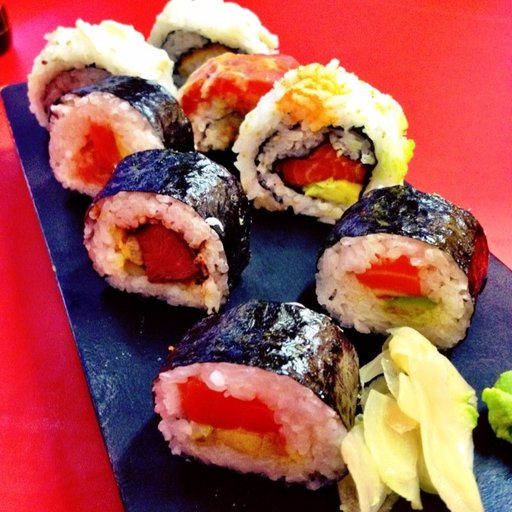
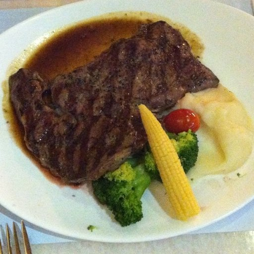
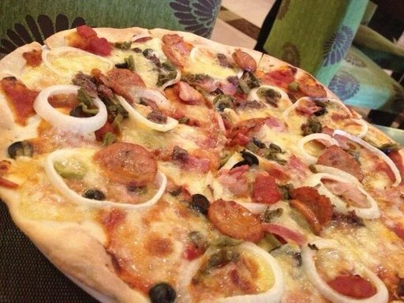

# Food_classification

Implementation of Food Image classification model using Pytorch.

3 classes :

## Sushi

## Steak

## Pizza

#  Example of model Prediction

Best_model accurancy 87 %

weight file:  2_model
